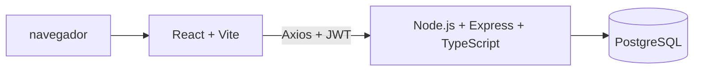

# Gestor de taller mecánico

Sistema web desarrollado para la Olimpiada Institucional de Programación de 7.º año de la EEST N.º 6 "Chacabuco", Morón, Buenos Aires.

Permite autenticar usuarios y administrar clientes y vehículos de un taller mecánico. El proyecto está organizado como una aplicación full stack con backend REST, frontend React y PostgreSQL.

## Estado del proyecto

- Autenticación con JWT y contraseñas protegidas con bcrypt.
- Roles de usuario: `admin`, `mecanico` y `recepcionista`.
- CRUD protegido de clientes.
- CRUD protegido de vehículos relacionados con clientes.
- PostgreSQL inicializado mediante `schema.sql`.
- Tests de backend con Jest y Supertest.
- Docker Compose para backend, frontend y base de datos.
- Pipeline de GitHub Actions con tests, type-check, lint, builds y construcción de imágenes Docker.

Las tablas de órdenes de trabajo, repuestos y turnos ya están definidas en el esquema, pero sus endpoints todavía no están implementados.

## Arquitectura



### Componentes

- **Frontend:** React, Vite, TypeScript, React Router y Axios.
- **Backend:** Node.js, Express y TypeScript ejecutado con `tsx`.
- **Base de datos:** PostgreSQL 16.
- **Autenticación:** JWT (`jsonwebtoken`) y bcrypt.
- **Testing:** Jest y Supertest.
- **Infraestructura:** Docker y Docker Compose.
- **CI/CD:** GitHub Actions.

## Estructura

```text
.
├── .github/workflows/ci.yml
├── docker-compose.yml
├── olimpiadas-backend/
│   ├── src/
│   │   ├── config/
│   │   ├── controllers/
│   │   ├── middlewares/
│   │   └── routes/
│   ├── tests/
│   ├── schema.sql
│   └── Dockerfile
└── olimpiadas-frontend/
    ├── src/
    └── Dockerfile
```

## Requisitos

- Node.js 20 o superior.
- npm.
- PostgreSQL 16, si se ejecuta sin Docker.
- Docker Desktop, si se utiliza Docker Compose.

## Ejecución local

### Backend

```powershell
cd olimpiadas-backend
npm ci
```

Crear un archivo `.env` dentro de `olimpiadas-backend`:

```env
DB_HOST=localhost
DB_USER=postgres
DB_PASS=tu contraseña
DB_NAME=taller_mecanico
DB_PORT=5432
JWT_SECRET=una_clave_secreta_segura
PORT=3000
```

Inicializar la base de datos ejecutando [schema.sql](./olimpiadas-backend/schema.sql) y arrancar el servidor:

```powershell
npm run dev
```

El backend queda disponible en `http://localhost:3000`.

### Frontend

```powershell
cd olimpiadas-frontend
npm ci
npm run dev
```

El frontend queda disponible en `http://localhost:5173`.

## Ejecución con Docker

Desde la raíz:

```powershell
docker compose up --build
```

Servicios publicados:

| Servicio | URL o puerto |
|---|---|
| Frontend | http://localhost:5173 |
| Backend | http://localhost:3000 |
| Healthcheck backend | http://localhost:3000/health |
| PostgreSQL | localhost:5432 |

Para detener los servicios:

```powershell
docker compose down
```

Para eliminar también los datos persistidos de PostgreSQL:

```powershell
docker compose down -v
```

## API

Todas las rutas de clientes y vehículos requieren un token JWT en el header:

```http
Authorization: Bearer <token>
```

### Autenticación

| Método | Endpoint | Descripción |
|---|---|---|
| `POST` | `/auth/register` | Registrar usuario |
| `POST` | `/auth/login` | Iniciar sesión y obtener JWT |

Ejemplo de login:

```json
{
  "email": "usuario@taller.com",
  "password": "contraseña"
}
```

### Clientes

| Método | Endpoint | Descripción |
|---|---|---|
| `GET` | `/clientes` | Listar clientes |
| `GET` | `/clientes/:id` | Obtener un cliente |
| `POST` | `/clientes` | Crear cliente |
| `PUT` | `/clientes/:id` | Actualizar cliente |
| `DELETE` | `/clientes/:id` | Eliminar cliente |

Campos principales: `nombre`, `apellido`, `telefono`, `email` y `dni`.

### Vehículos

| Método | Endpoint | Descripción |
|---|---|---|
| `GET` | `/vehiculos` | Listar vehículos con datos del cliente |
| `GET` | `/vehiculos/:id` | Obtener un vehículo |
| `POST` | `/vehiculos` | Crear vehículo |
| `PUT` | `/vehiculos/:id` | Actualizar vehículo |
| `DELETE` | `/vehiculos/:id` | Eliminar vehículo |

Campos principales: `patente`, `marca`, `modelo`, `anio` y `cliente_id`.

### Salud del servicio

```http
GET /health
```

Respuesta esperada:

```json
{
  "status": "ok",
  "db": "connected"
}
```

## Base de datos

El esquema contiene las tablas:

```text
usuario
cliente
mecanico
vehiculo
orden_trabajo
repuesto
detalle_orden
turno
```

Las tablas de órdenes de trabajo, repuestos y turnos quedan preparadas para una futura ampliación del sistema.

## Tests y validaciones

Backend:

```powershell
cd olimpiadas-backend
npm test
npm run build
```

Frontend:

```powershell
cd olimpiadas-frontend
npm run lint
npm run build
```

El pipeline de [GitHub Actions](./.github/workflows/ci.yml) ejecuta automáticamente:

1. Instalación reproducible con `npm ci`.
2. Tests y verificación de tipos del backend.
3. Lint y build del frontend.
4. Construcción de las imágenes Docker.

## Seguridad y configuración

- No subir archivos `.env` al repositorio.
- Usar un `JWT_SECRET` diferente y seguro en cada entorno.
- No utilizar contraseñas reales en ejemplos o documentación.
- En producción, configurar credenciales mediante secretos del entorno o del proveedor de despliegue.

## Próximas mejoras

- Integración con un servicio externo, por ejemplo geocodificación con OpenStreetMap/Nominatim.
- Endpoints para órdenes de trabajo y turnos.
- Validaciones más completas de entrada.
- Despliegue en un entorno remoto.
